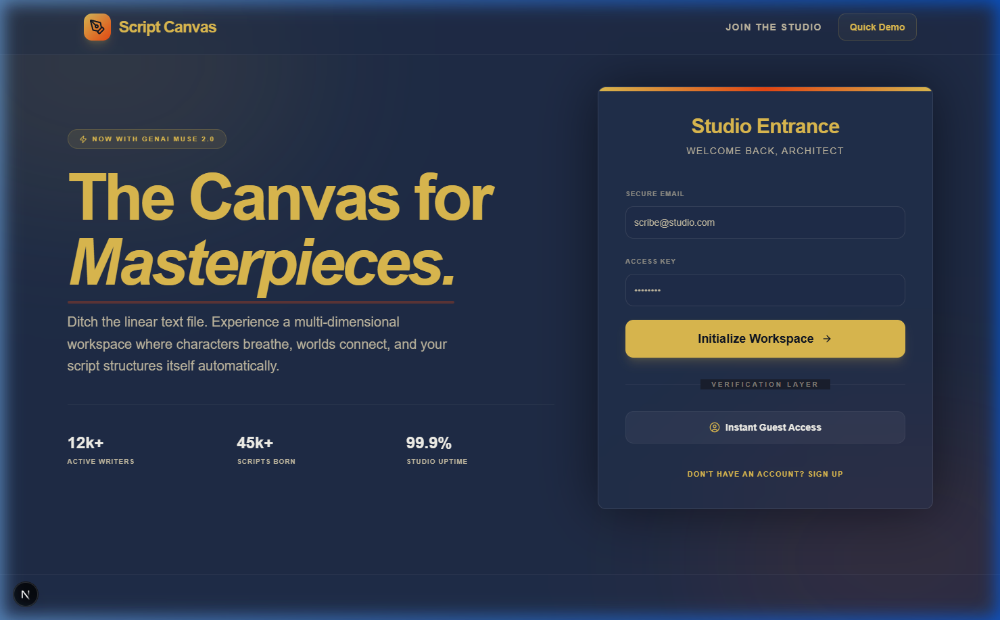

# Script Canvas

Script Canvas is a professional, multi-dimensional workspace designed for screenwriters and story architects. It moves beyond linear text editing to provide a holistic environment where characters, world-building, and narrative structure converge.

## 🖼️ Preview

_The Script Canvas landing page, featuring a sleek, dark-themed UI tailored for writers. It showcases a premium design with a central value proposition: "The Canvas for Masterpieces", and a secure access portal for both new and existing "architects of story"._

## 🌟 Vision

In traditional screenwriting software, your story is often confined to a single document. Script Canvas breaks this mold by offering a suite of integrated tools that allow writers to manage every facet of their creative vision in one unified, aesthetically pleasing interface.

## ✨ Key Features

### 🖋️ Dynamic Workspace

- **Script Editor**: A focused, distraction-free environment for drafting scenes with industry-standard formatting.
- **Scene Manager**: Reorganize your story beats visually using drag-and-drop scene cards.
- **Plot Timeline**: Visualize your narrative arc and track key plot points across Acts.

### 📖 Story Bible

- **Character Profiles**: Build deep, complex personas for your cast, tracking their motivations, backstories, and archetypes.
- **World Compendium**: Maintain a detailed "wiki" of locations, lore, and significant items to ensure internal consistency.

### 🤖 The Muse (AI Assistant)

- Powered by **Google Genkit (Gemini 2.5 Flash)**, The Muse acts as your creative partner.
- Generate suggestions for character traits, mysterious locations, or cryptic dialogue when you hit a creative block.

### 🧘 Zen Mode

- Activate **Focus Mode** to hide all UI elements except for your script, allowing you to reach a deep flow state.
- Choose between modern sans-serif or classic typewriter fonts to suit your writing style.

### ☁️ Cloud Sync

- Built on **Firebase**, your work is automatically synchronized and backed up, ensuring your scripts are accessible and secure.

## 🛠️ Tech Stack

- **Framework**: [Next.js 15](https://nextjs.org/) (App Router)
- **Styling**: [Tailwind CSS](https://tailwindcss.com/) & [ShadCN UI](https://ui.shadcn.com/)
- **Backend**: [Firebase Authentication](https://firebase.google.com/docs/auth) & [Cloud Firestore](https://firebase.google.com/docs/firestore)
- **AI Integration**: [Google Genkit](https://github.com/firebase/genkit)
- **Icons**: [Lucide React](https://lucide.dev/)

---

_Designed for those who don't just write scripts, but architect worlds._
